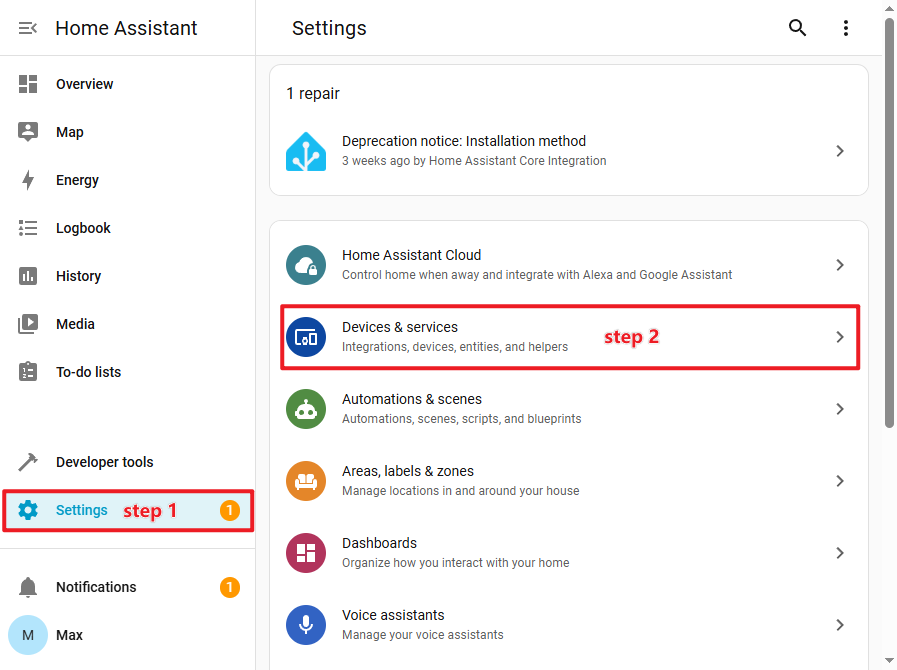
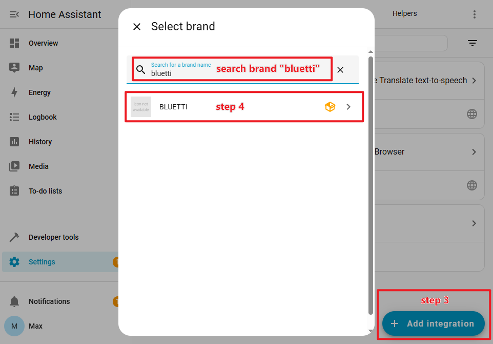
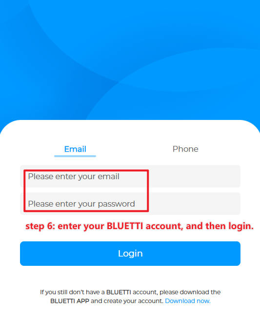
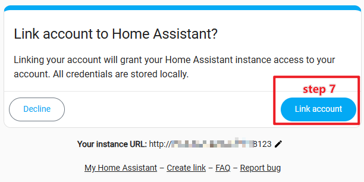
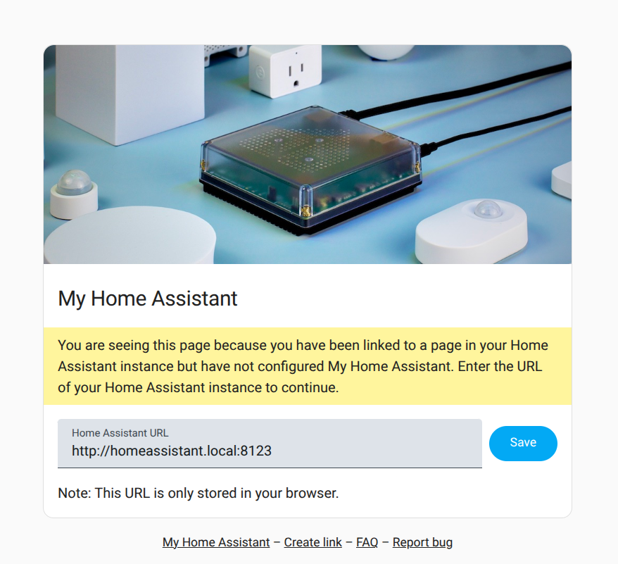
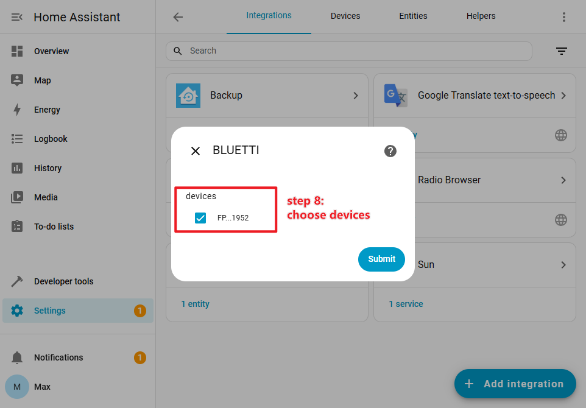
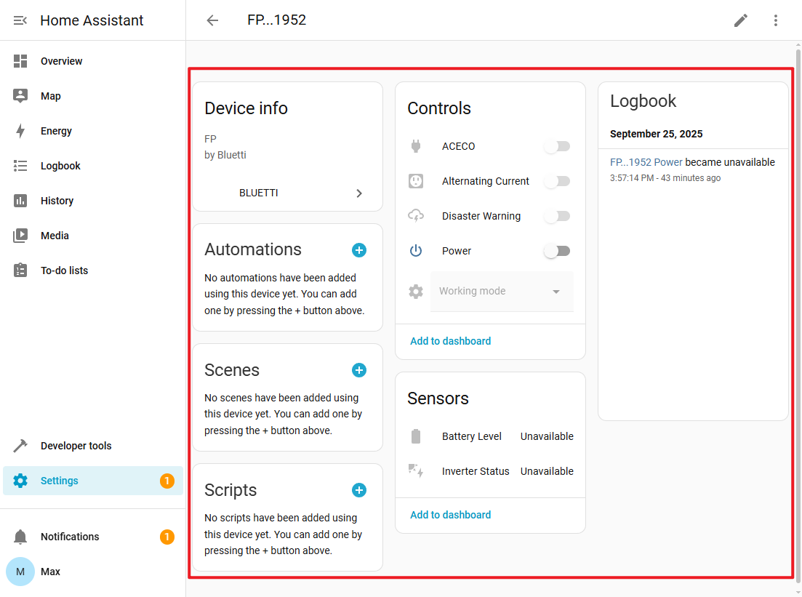

# BLUETTI-integratie voor Home Assistant

[🇬🇧 Engels](./README.md) | [🇳🇱 Nederlands](./README_nl.md) |
[🇩🇪 Duits](./README_de.md) | [🇨🇳 Chinees](./README_zh.md)

De **BLUETTI-integratie** is een geïntegreerde component van Home Assistant, en
word officieel ondersteund door BLUETTI. Hiermee kun je BLUETTI slimme
powerstations gebruiken binnen Home Assistant.

## ✨ Functies

- ✅ Aan/uit-schakelaar
- ✅ Omvormerstatus
- ✅ Batterijladingstoestand (SoC)
- ✅ AC schakelaar
- ✅ DC schakelaar
- ✅ Hoofdunit aan/uit-schakelaar
- ✅ AC ECO-modus
- ✅ DC ECO-modus
- ✅ Bedrijfsmodus-schakelaar: Noodstroom, Eigen verbruik, Piek- en daltarief
- ✅ Slaapstand

## 🎮 Ondersteunde powerstationmodellen

> [!NOTE]
>
> In toekomstige versies zal de BLUETTI-integratie worden uitgebreid met
> ondersteuning voor nieuwe en bestaande powerstationmodellen.

| Powerstation model                       | Omvormerstatus | Batterij-SoC | AC-schakelaar | DC-schakelaar | Hoofdschakelaar | AC ECO | DC ECO | Werkmodusschakelaar | Slaapstand |
| :--------------------------------------- | :------------: | :----------: | :-----------: | :-----------: | :-------------: | :----: | :----: | :-----------------: | :--------: |
| AP300                                    |                |      ✅      |      ✅       |               |                 |   ✅   |        |         ✅          |     ✅     |
| EL300                                    |                |      ✅      |      ✅       |      ✅       |                 |   ✅   |   ✅   |         ✅          |     ✅     |
| EL320,<br />AORA320                      |                |      ✅      |      ✅       |      ✅       |                 |   ✅   |   ✅   |         ✅          |     ✅     |
| EL400                                    |                |      ✅      |      ✅       |      ✅       |                 |   ✅   |   ✅   |         ✅          |     ✅     |
| EP13K                                    |       ✅       |      ✅      |               |               |       ✅        |        |        |         ✅          |            |
| EP2000                                   |       ✅       |      ✅      |               |               |       ✅        |        |        |         ✅          |            |
| EP6K                                     |       ✅       |      ✅      |               |               |       ✅        |        |        |         ✅          |            |
| EP760                                    |       ✅       |      ✅      |               |               |       ✅        |        |        |                     |            |
| FP                                       |       ✅       |      ✅      |      ✅       |      ✅       |                 |   ✅   |   ✅   |         ✅          |     ✅     |
| PR100V2,<br />EL100V2,<br />AORA100V2    |                |      ✅      |      ✅       |      ✅       |                 |   ✅   |   ✅   |         ✅          |     ✅     |
| PR200V2,<br />Elite 200 V2,<br />AORA200 |                |      ✅      |      ✅       |      ✅       |                 |   ✅   |   ✅   |         ✅          |     ✅     |
| PR30V2,<br />EL30V2                      |                |      ✅      |      ✅       |      ✅       |                 |   ✅   |   ✅   |         ✅          |     ✅     |

## 📦 Installatie van de BLUETTI-integratie

### Home Assistant Operating System

Volg onderstaande stappen om de **BLUETTI-integratie** te installeren in **Home
Assistant**.

Je kunt hiervoor gebruikmaken van de **Advanced SSH & Web Terminal**-add-on of
verbinding maken met je **Home Assistant-server** via **SSH**.

```bash
ssh gebruikersnaam@IP-adres-van-de-host
```

Als je gebruik maakt Home Assistant als Docker-container op **Windows**,
**macOS** of **Linux**? Log dan eerst in op de host (de computer waarop Docker
actief is):

```bash
ssh gebruikersnaam@IP-adres-van-de-host
```

Open vervolgens een shell in de Home Assistant-container:

```bash
docker exec -it container-naam /bin/bash
```

### Installatiestappen

1. **Ga naar de configuratiemap van Home Assistant:** /<ha workspaces>/

   ```bash
   cd config 2> /dev/null || echo "Je bevindt je al in de map 'config'. Ga verder met stap 2."
   ```

2. **Maak de map `custom_components` aan** (als deze nog niet bestaat):

   ```bash
   mkdir -pv custom_components
   ```

3. **Kloon de GitHub-repository van de BLUETTI-integratie:**

   ```bash
   git clone https://github.com/bluetti-official/bluetti-home-assistant.git
   cp -a /config/bluetti-home-assistant/custom_components/bluetti /config/custom_components/bluetti
   ```

4. **Herstart Home Assistant** om de nieuwe integratie te laden:
   - Voor **Home Assistant Operating System**:

     ```bash
     ha core restart
     ```

   - Voor **Docker-installaties**:

     ```bash
     docker restart container-naam
     ```

### Installatie via Home Assistant Community Store (HACS)

De **BLUETTI-integratie** is nog niet opgenomen in de officiële
[HACS-repository](https://github.com/hacs/integration). Daarom moet je deze
handmatig toevoegen als een **aangepaste repository**.

> [!NOTE]
>
> **Wat is HACS?** HACS (_Home Assistant Community Store_) is een uitbreiding
> voor Home Assistant die fungeert als een soort **app store** voor integraties
> van derden. Zorg ervoor dat HACS al is geïnstalleerd voordat je aangepaste
> repositories toevoegt.

#### Installatiestappen

1. Open **HACS → Integraties → Aangepaste repositories** (rechtsboven op de
   pagina).

2. Voeg de volgende repository toe en selecteer het juiste type:
   - **Repository:** [https://github.com/bluetti-official/bluetti-home-assistant.git](https://github.com/bluetti-official/bluetti-home-assistant.git)
   - **Type:** Integration

3. Ga daarna naar **HACS → Integraties**. De **BLUETTI**-integratie verschijnt
   nu in de lijst. Klik erop om te installeren.

4. **Herstart Home Assistant** om de installatie te voltooien.

## ⚙️ Configuratie van de integratie

1. Ga naar **“_Instellingen → Apparaten en diensten_”** om de lijst met
   integraties te openen.

   

2. Klik op **“_Integratie toevoegen_”**, zoek naar het merk **bluetti**, en
   selecteer de **BLUETTI**-integratie om de OAuth-autorisatie te starten.

   

3. Je moet toestemming geven zodat **Home Assistant** toegang krijgt tot je
   BLUETTI-account en verbinding kan maken met de BLUETTI-cloudservice.

   

4. Voer je BLUETTI-accountgegevens in om in te loggen en te autoriseren.

   

5. Bevestig dat **Home Assistant** je BLUETTI-account mag koppelen.

   

6. Werk de URL bij met het adres van je **Home Assistant**-instantie.

   

7. Selecteer vervolgens de BLUETTI-apparaten die je wilt gebruiken en beheren in
   Home Assistant.

   
   

## ❓ Veelgestelde vragen (FAQ)

### **Vraag:** De BLUETTI-integratie wordt niet gevonden na installatie?

**Antwoord:** Controleer of de map `custom_components` op de juiste locatie
staat en start Home Assistant opnieuw op.

### **Vraag:** De integratie blijft offline of kan geen verbinding maken met de BLUETTI-server?

**Antwoord:** Controleer je **netwerkverbinding** **poortinstellingen** en
**firewall** om er zeker van te zijn dat **Home Assistant** toegang heeft tot de
BLUETTI-powerstations.

### **Vraag:** Werkt de BLUETTI-integratie lokaal?

**Antwoord:** Nee, de BLUETTI-integratie werkt op dit moment via de cloud. Er
wordt op dit moment gewerkt aan een lokale optie, maar de ontwikkeling daarvan
kost tijd.

## 🔄 Updaten van de BLUETTI-integratie?

### Home Assistant Operating System

1. **Werk de BLUETTI-integratie bij** (indien nodig):

   ```bash
   cd /config/bluetti-home-assistant
   git pull
   cp -a --force custom_components/bluetti /config/custom_components/bluetti
   ```

2. **Herstart Home Assistant** om de bijgewerkte integratie te laden:
   - Voor **Home Assistant Operating System**:

     ```bash
     ha core restart
     ```

   - Voor **Docker-installaties**:

     ```bash
     docker restart container-naam
     ```

### Home Assistant Community Store

Voer de update uit via de HACS-beheerpagina.

## 📮 Ondersteuning & feedback

💬 Heb je vragen, problemen of suggesties? Laat het ons weten via GitHub issues: [https://github.com/bluetti-official/bluetti-home-assistant/issues](https://github.com/bluetti-official/bluetti-home-assistant/issues)
